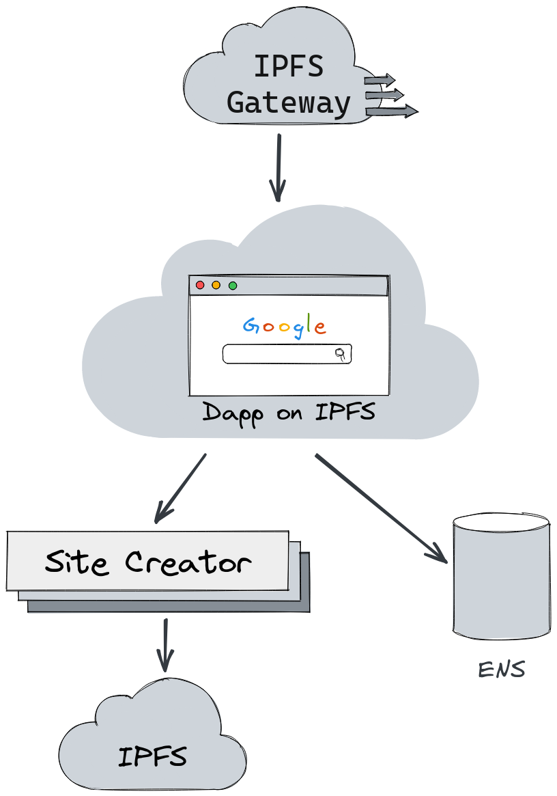

# RoadICM ENS

Create your Web3 profile and own every part of it.

Content:

* [About](#about)
* [Principles](#principles)
* [Architecture](#architecture)
  * [Contracts](contracts/README.md)
  * [Dapp](site/README.md)
  * [Backend](backend/README.md)
* [Setup](#setup)

## About

This dapp allows a user to create their own link aggregator website on Web3. It
is an MVP version but entirely decentralized. With the app being
decentralized, we are able to give the user complete ownership of their data
and the ability to have a site without worrying about hosting.

If you trust no one, keep reading on how to launch your own generator.

## Principles

Open-source or bust. We believe in using strong copyleft licensing so that lock-in can be avoided.

Users own their work. We believe the user should own as much of the output as possible.

Support without force. We believe in helping users achieve a goal but we do not want to force them to an outcome.

## Architecture

There are four key components:

* the site generator dapp
* the custom ENS subdomain registrar
* the user's site
* the site deployer

[The dapp](site/README.md) is a Svelte SPA that lives on IPFS. It is automatically deployed by
Fleek on every push to `main`.

[The smart contract](contracts/README.md) is the controller of the main ENS node
and is used to register subnodes. After the subnode is registered, the
PublicResolver is updated with any text records that were passed to the function.
This process works exactly like `multicall` (a function on PublicResolver).
Once all of the records are updated, ownership is transferred from the smart
contract to the `msg.sender`.

Prior to the registrar being called, an [HTML file is deployed](backend/README.md) to IPFS
(via [https://web3.storage]()). This HTML file has the users chosen subdomain hardcoded into
the file. When loaded in a browser, the embedded javascript will use the
subdomain to pull ENS text records off the blockchain (via Alchemy API).

This HTML file is deployed by Netlify Functions as a way to hide the web3.storage API token
and to simplify compiling the main dapp.

## Setup

A domain needs to be registered with ENS to use this application.
Visit https://app.ens.domains and register a node on either mainnet or a
testnet.

