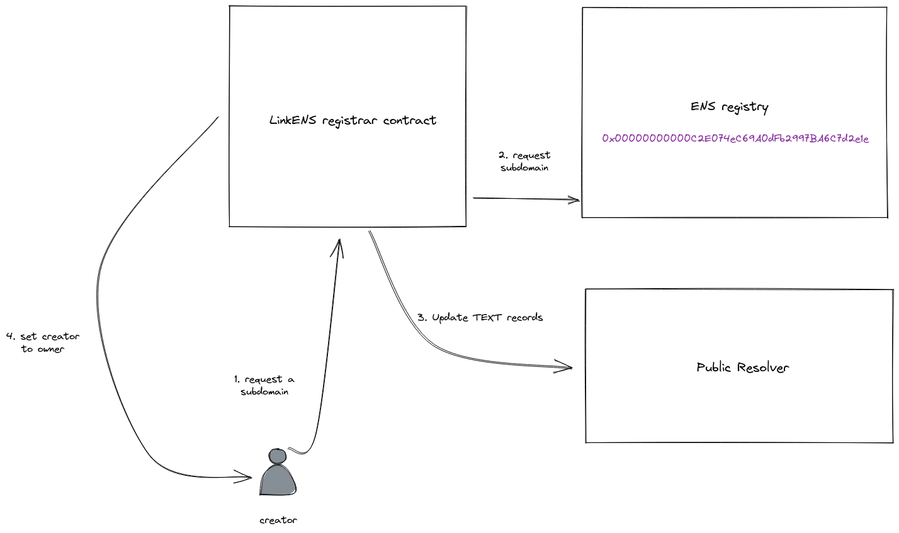

# LinkENS Contracts

* [Setup](#setup)
* [Deploy](#deploy)
* [SiteManager](#sitemanager)
  * [Usage](#usage)
* [Testing](#testing)

## Setup

1. Clone project and switch to _contracts_
    ```sh
    git clone https://github.com/0xcharchar/ethonline2021.git
    cd ethonline2021/contracts
    ```
2. Optional: set node version with NVM
    ```sh
    nvm use
    ```
3. Install dependencies
    ```sh
    npm install
    ```
4. Create environment file
    ```sh
    touch .env
    ```
5. Fill in environment value with template and your data
    ```sh
    # Template env file
    ALCHEMY_API_KEY=
    ENS_REGISTRY=0x00000000000C2E074eC69A0dFb2997BA6C7d2e1e
    WALLET_PK_ROPSTEN=
    COINMARKETCAP_API_KEY=
    ```

## Deploy

There is a deploy script in the **scripts/** folder, it can be run like this:

```sh
# for local
npx hardhat run scripts/deploy.js

# for ropsten
npx hardhat run scripts/deploy.js --network ropsten
```

Local deployments will also deploy all of the necessary ENS contracts.

## SiteManager

SiteManager is a custom registrar that provides subnode for a single node,
updates a resolver with provided information, and assigns ownership of the
subnode to the sender.



### Usage

#### `subdomainRegister`

Signature:

```solidity
function subdomainRegister (bytes32 label, bytes[] calldata data) external returns (bytes[] memory results);
```

* `label` is the subdomain to be registered. For example, if the root domain is
  _help.eth_ and the `label` is _no_ then the subdomain will be _no.help.eth_.
* `data` is a collection of contract calls on the stored ENS resolver. Default
  deployment uses the ENS PublicResolver so any properly encoded functions
  used here will be called on PublicResolver. Note that `multicall` will
  fail. See available functions in [ENS PublicResolver docs](https://docs.ens.domains/contract-api-reference/publicresolver).

To use this function from Javascript (in a browser), here is a brief example using [ethers](https://docs.ethers.io/v5/).

```js
import { ethers } from 'ethers'
import { Resolver } from '@ensdomains/ens-contracts'

const RESOLVER_ADDRESS = ''
const SITE_MANAGER_ADDRESS = ''

const rootNodeName = 'somedemo.eth'
const labelHash = label => ethers.utils.namehash(`${ethers.utils.id(label)}.${rootNodeName}`)

const provider = new ethers.providers.Web3Provider(window.ethereum)

async function createSubdomain (label) {
  // Get signer from metamask
  await provider.send("eth_requestAccounts", [])
  const signer = provider.getSigner()

  // Create contract insances
  const resolver = new ethers.Contract(RESOLVER_ADDRESS, Resolver, signer)
  const siteManagerAbi = [
    'function subdomainRegister(bytes32 label, bytes[] calldata data) external returns (bytes[] memory)'
  ]
  const siteManager = new ethers.Contract(SITE_MANAGER_ADDRESS, siteManagerAbi, signer)

  // Register a subdomain
  const encodedFunctions = [
    resolver.interface.encodeFunctionData('setText', [labelHash(label), 'com.github', '0xcharchar']),
  ]
  const regTx = await siteManager.subdomainRegister(ethers.utils.id(label), encodedFunctions, { gasLimit: 500000 })
  const txResult = await regTx.wait()
  console.log('Registration result', txResult)
}

createSubdomain('mysub')
```

## Testing

Testing is done with hardhat:

```sh
npx hardhat test
```
